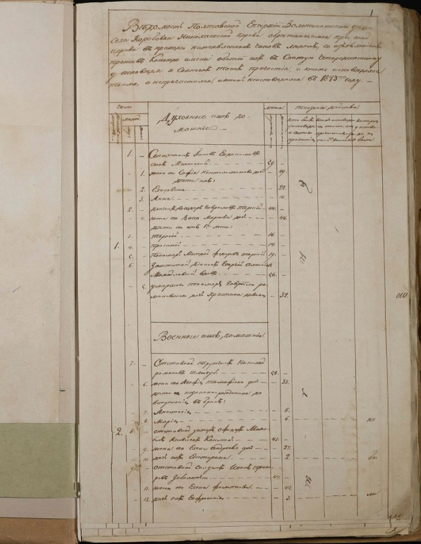
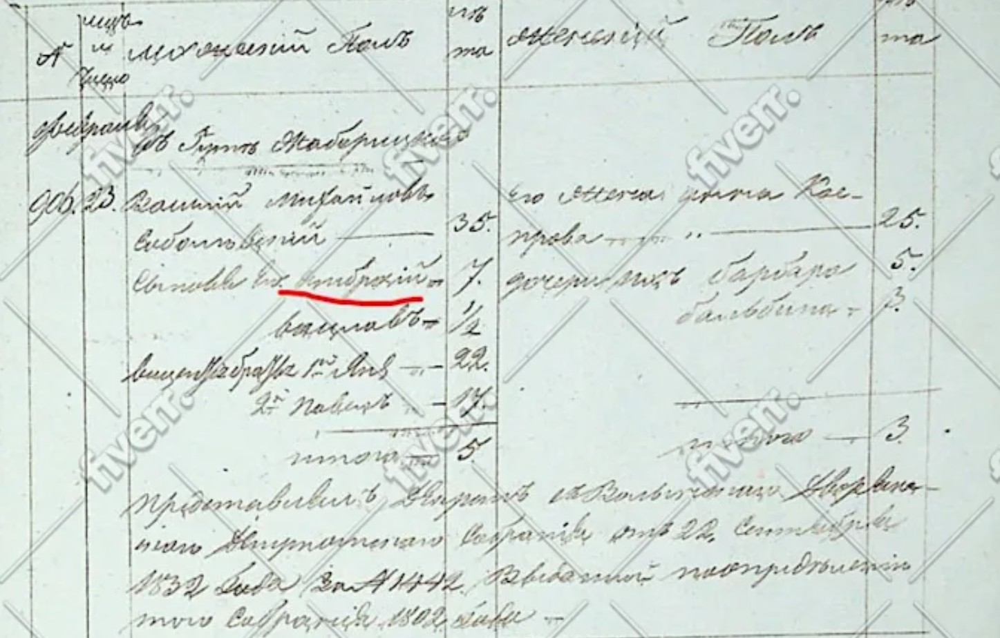
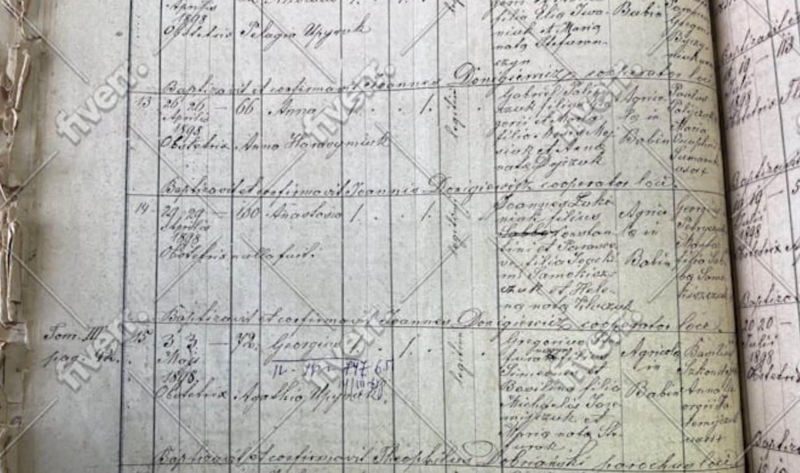
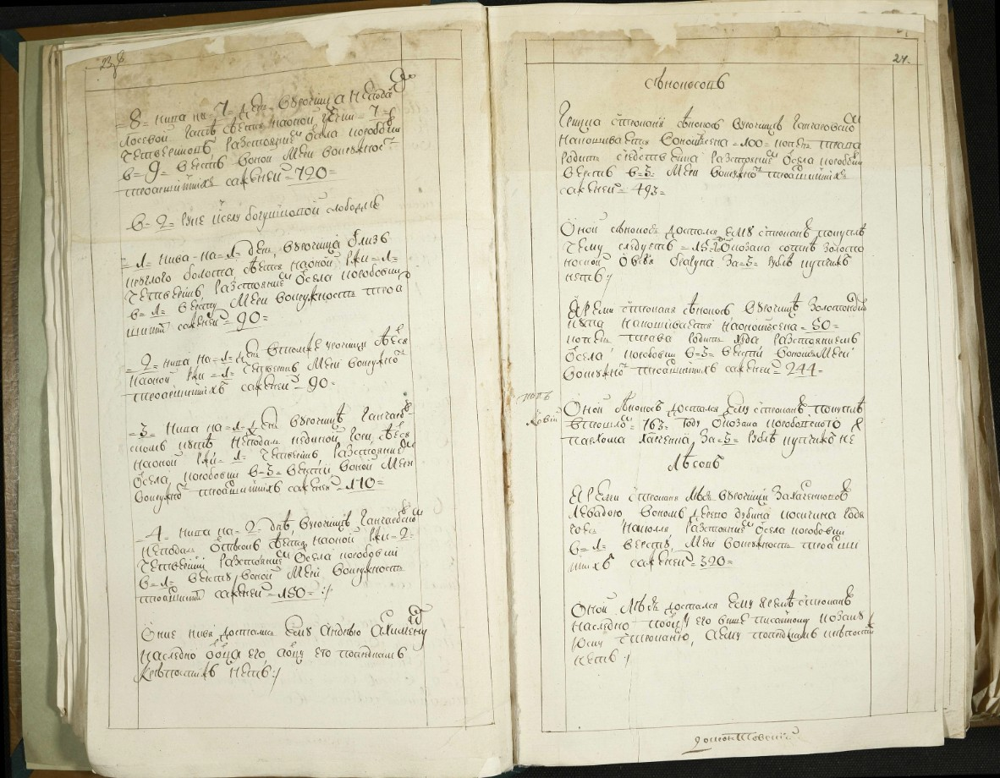

# Find Your Ancestors in Ukraine Online

Professional genealogy research to find your ancestors in Ukraine. Access Ukraine archives online, family search records, and expert ancestry research tracing your Ukrainian heritage from 1790-1920.

[Start Your Research](https://go.fiverr.com/visit/?bta=162622&brand=fiverrcpa&landingPage=https%253A%252F%252Fwww.fiverr.com%252Foleksandrnedash%252Ffind-your-ancestors-in-ukraine)

---

---

## Expert Ukraine Genealogy Research

Oleksandr N. is a professional genealogist from Ukraine who will help you find your ancestors in Ukraine. With extensive experience in Ukraine genealogy records and archival research, he specializes in tracing family histories through historical documents.

Specializing in Ukraine archives online research from **1790–1920**, he has successfully built dozens of family trees and helped clients worldwide discover their Ukrainian heritage through family search Ukraine methods.

Fluent in Old East Slavic, Russian, and Ukrainian documents, ensuring accurate translations and comprehensive ancestry Ukraine research for every client seeking to find their roots.

**130+** Years of History Uncovered

---

## Ukraine Archives Online – Sample Documents

| Document Type | Description |
|---------------|-------------|
|  **Population Census** | Ukraine archives online record |
|  **Church Records** | Baptism & marriage entries |
|  **Revision Lists** | Household census data |
|  **Parish Registers** | Vital records documentation |

---

## Ancestry Ukraine Research Services

| Service | Description |
|---------|-------------|
| 🌳 **Ancestry Research** | Find your ancestors in Ukraine through comprehensive genealogical research using Ukraine archives online and historical records. |
| 📖 **Document Translation** | Professional translation from Old East Slavic, Russian, and Ukrainian for your family search Ukraine documents. |
| 🔍 **Ukraine People Search** | Locate and reconnect with relatives in Ukraine through expert archival research and Ukraine genealogy records. |
| 📊 **Family Trees** | Create detailed family trees using family search Ukraine methods in your preferred format or online service. |

---

## How to Find Your Ancestors in Ukraine

1. **Consultation** – Discuss your Ukraine genealogy records research requirements.
2. **Research** – Search through Ukraine archives online and historical documents.
3. **Translation** – Translate and organize all ancestry Ukraine documents found.
4. **Delivery** – Receive your complete family tree and records.

---

## Ukraine Genealogy Resources

### Family Search Ukraine Records

Accessing Ukraine genealogy records online can be challenging without expert guidance. Our professional research service helps you navigate Ukraine archives online, including church records, census data, and civil registration documents that are essential for family search Ukraine projects.

### Ukraine People Search & Ancestry

Whether you're looking for Ukraine people search assistance or comprehensive ancestry Ukraine research, our expert genealogist can help trace your family roots through Ukraine archives online and historical Ukraine genealogy records dating back to the 18th century.

---

## Client Reviews

> ★★★★★
>
> "The only bad thing about this research is that I didn't do it sooner! Oleksandr proved me wrong and did an amazing job accessing sources about my great-great-great grandfather in Ukraine in the 1800s."
>
> — Satisfied Client

> ★★★★★
>
> "The journey through my Ukrainian roots has been invaluable. Olek demonstrates exceptional expertise — thorough, engaging, and truly dedicated to his work."
>
> — Happy Customer

> ★★★★★
>
> "Highly recommended! Professionalism and dedication exceeded all expectations. The detailed research and translations were exceptional quality."
>
> — Delighted Client

---

## Why Choose Our Ukraine Genealogy Service

| Feature | Description |
|---------|-------------|
| 🏆 **Level 2 Seller** | Recognized expertise on Fiverr platform |
| 📚 **Proven Experience** | Dozens of Ukraine ancestry trees built |
| 🌐 **Language Expert** | Old Slavic document specialist |
| 🤝 **Personal Service** | Free consultation before purchase |

---

## Ready to Find Your Ancestors in Ukraine?

Contact Oleksandr to begin your genealogy research Ukraine journey and uncover your family history through Ukraine archives online.

[Contact on Fiverr](https://go.fiverr.com/visit/?bta=162622&brand=fiverrcpa&landingPage=https%253A%252F%252Fwww.fiverr.com%252Foleksandrnedash%252Ffind-your-ancestors-in-ukraine)

---

Professional Ukraine Genealogy Research Services

Find Your Ancestors in Ukraine | Ukraine Archives Online

[View Fiverr Profile](https://go.fiverr.com/visit/?bta=162622&brand=fiverrcpa&landingPage=https%253A%252F%252Fwww.fiverr.com%252Foleksandrnedash)

© 2024 Find Your Ancestors in Ukraine. All rights reserved.
